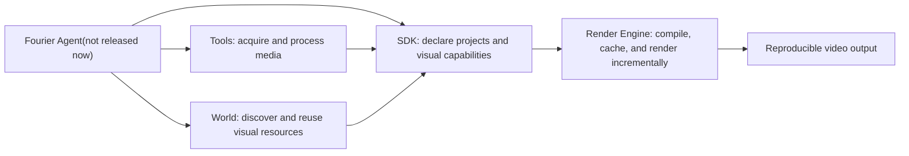

<p align="center">
  
</p>

<h1 align="center">Fourier</h1>

<p align="center"><strong>The NO.1 programmable video engineering platform for agents.</strong></p>

<p align="center">
  <a href="./fourier-render-engine/README.md"></a>
  <a href="./fourier-sdk/README.md"></a>
  
  
  
  
  
 </p>

<p align="center">English · <a href="./README.zh-CN.md">简体中文</a></p>

Fourier treats video as a readable, composable, and verifiable project rather than a one-shot black-box output. Agents interpret intent and organize content, developers build reusable visual capabilities, and the Render Engine executes the result reliably.

## Made entirely with Fourier

<div align="center">
  <video src="./ad.mp4" controls playsinline preload="metadata" width="100%">
    Your browser does not support embedded video. Use the link below to watch the film.
  </video>
</div>

<p align="center"><a href="./ad.mp4"><strong>▶ Watch or download the Fourier promotional film</strong></a></p>

This film is the rendered result of the [Fourier Ad project](./fourier-ad/README.md). Its concept, script, scene breakdown, visual-component selection, TSX authoring, asset orchestration, animation, audio timing, validation, and final rendering were completed autonomously by agents. **No human intervention was involved in the creative or production process.**

## Why Fourier

Most AI video workflows are good at producing a result, but much weaker at modifying, reusing, and validating it afterward. Fourier takes an engineering-first approach to what comes after generation:

- **Reproducible results:** time, randomness, assets, and the rendering environment are controlled so the same project can be rebuilt consistently.
- **Incremental, efficient rendering:** dependency-aware fingerprints and layered caches let Fourier reuse unchanged Scenes, Templates, artifacts, media preparation, and TTS output, while independent visual work can run in parallel.
- **Editable structure:** a video is composed from Projects, Scenes, Templates, components, and assets, so a local change does not require regenerating everything.
- **Reusable capabilities:** high-quality React, Motion, and 3D components can be built once and reused across agents, projects, and brands.
- **Agent-operable interfaces:** types, schemas, structured metadata, stable CLI output, and error codes help agents configure capabilities and diagnose failures.
- **An extensible ecosystem:** rendering, authoring, media tools, and visual-resource discovery are separate layers, allowing models, tools, and components to evolve independently.

Fourier is not another text-to-video prompt box. It is infrastructure for agents, developers, and visual assets to collaborate on videos that remain maintainable after they are generated.

## Projects

| Project | Role | Focus |
| --- | --- | --- |
| [Fourier Render Engine](./fourier-render-engine/README.md) | Deterministic execution | Compiles TSX projects and uses incremental caching, parallel visual preparation, and FFmpeg to render efficiently |
| [Fourier SDK](./fourier-sdk/README.md) | Developer interface | Authors typed Projects, React artifacts, Motion, Three.js, Scenes, and Templates |
| [Fourier Tools](./fourier-tools/README.md) | Media capability layer | Local matting, background removal, image upscaling, and model integration |
| [Fourier World](./fourier-world/README.md) | Video component and visual-asset library | Helps agents discover, understand, and reuse designed and validated dynamic visual capabilities |
| [Fourier Ad](./fourier-ad/README.md) | Reference project | Demonstrates how Scenes, components, media, and audio form a complete video |

The Render Engine and SDK are the core packages in the root Bun workspace. Tools is an independently extensible media-processing layer, and Ad is a real video project built with the core packages. World is Fourier's visual-resource network for components, Motion, Scenes, Templates, 3D scenes, and brand systems that agents can discover and reuse.

## How the system fits together



A typical workflow starts with an agent preparing assets through Tools and selecting suitable components from World. The agent then assembles a Project and its Scenes through the SDK, and the Render Engine validates and renders the result. Successful capabilities can return to World and become reusable building blocks for future projects.

## Built for iteration, not just first render

AI-assisted video production involves many small revisions: changing one subtitle, swapping one asset, adjusting one component, or regenerating a single Scene. Fourier fingerprints project declarations, module contents, artifact dependencies, assets, TTS inputs, and the render profile. Unchanged work can be recovered from layered caches, while changed work is prepared again and independent tasks can execute in parallel.

Determinism is what makes this acceleration trustworthy: Fourier can reuse a cached result only because the same inputs are expected to produce the same pixels and timing. This makes incremental rendering a direct consequence of the project model rather than a best-effort shortcut.

## Quick start

Fourier requires [Bun](https://bun.sh/) `>= 1.3`, FFmpeg/ffprobe, and Chromium. The repository includes one-click installers for macOS, Linux, and Windows. They install the runtime dependencies and globally install `@fourier-video/sdk` and `@fourier-video/render-engine`.

### macOS / Linux

Run this from the repository root:

```bash
./install.sh
```

The installer lets you choose Chinese or English. You can also select English without the prompt:

```bash
./install.sh --lang en
```

On macOS, FFmpeg is installed with Homebrew; the script installs Homebrew first when necessary. On Linux, it detects `apt`, `dnf`, `yum`, `pacman`, `zypper`, or `apk`, and may ask for your `sudo` password. Both macOS and Linux use Bun's official `curl -fsSL https://bun.sh/install | bash` command.

### Windows

For Windows users, we recommend developing directly in [CNB](https://cnb.cool/voidfun/fourier). Its browser-based cloud environment requires no local toolchain configuration, so you can open the project and start coding immediately.

#### Local installation (optional)

Use the PowerShell one-click installer only when you need Fourier installed and rendered locally. Open PowerShell in the repository root and run:

```powershell
powershell -ExecutionPolicy Bypass -File .\install.ps1
```

You can select English without the prompt:

```powershell
powershell -ExecutionPolicy Bypass -File .\install.ps1 -Lang en
```

The Windows installer uses Bun's official PowerShell installer and installs FFmpeg with `winget`. If `winget` is unavailable, install or update App Installer from Microsoft Store first.

Verify the global commands after installation:

```bash
fourier --help
fourier-sdk --help
```

### Develop from source

To work on this repository, install the workspace dependencies from the repository root:

```bash
# Install the Render Engine and SDK workspace dependencies
bun install

# Install Chromium and its system dependencies for real DOM rendering
bunx playwright install --with-deps chromium

# Validate the reference ad project
bun run fourier-render-engine/src/cli.ts validate fourier-ad/main.tsx

# Render the reference ad project
bun run fourier-render-engine/src/cli.ts render fourier-ad/main.tsx \
  --output /tmp/fourier-ad.mp4 \
  --overwrite
# Render the same project again to experience incremental cache reuse
bun run fourier-render-engine/src/cli.ts render fourier-ad/main.tsx \
  --output /tmp/fourier-ad.mp4 \
  --overwrite
```

Useful core-package checks:

```bash
bun run typecheck
bun run test:sdk
bun run test:dom
```

The Python and model dependencies used by Tools are not installed by the root workspace; see its dedicated README. Fourier World connects to the authoring workflow through the SDK's World capabilities.

## Where to start

- To make a video, begin with the [Fourier Ad](./fourier-ad/README.md) project structure.
- To build a component, animation, or 3D scene, read the [Fourier SDK](./fourier-sdk/README.md).
- To integrate rendering into a service or automation pipeline, see the [Render Engine](./fourier-render-engine/README.md) CLI, HTTP API, and `--ai` protocol.
- To extend media processing, read [Fourier Tools](./fourier-tools/README.md).
- To find components, Motion, Scenes, or Templates that agents can understand and compose directly, explore [Fourier World](./fourier-world/README.md).

## Repository conventions

- Video projects, Scenes, and Templates use `main.tsx` as their entry point.
- Prefer project-local relative asset paths over non-reproducible runtime network dependencies.
- Fourier drives animation from absolute time; do not depend on wall-clock time, unseeded randomness, or previous-frame state.
- The Render Engine, SDK, Tools, and World keep separate responsibilities and collaborate through explicit project and protocol boundaries.

## Fourier is not a video model

Video models can be valuable capabilities inside a workflow, but Fourier is the engineering system around them. It organizes editable project structure, reusable visual resources, media tools, deterministic execution, and incremental rendering so generated content can become a maintainable production asset.
