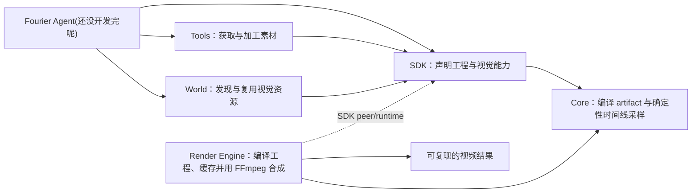

<p align="center">
  
</p>

<h1 align="center">Fourier</h1>

<p align="center"><strong>面向 Agent 的可编程视频工程平台。</strong></p>

<p align="center">
  <a href="./fourier-render-engine/README.zh-CN.md"></a>
  <a href="./fourier-sdk/README.zh-CN.md"></a>
  
  
  
  
  
</p>

<p align="center"><a href="./README.md">English</a> · 简体中文</p>

Fourier 不把视频当作一次性生成的黑盒文件，而是把它表示成可读、可组合、可验证的工程：Agent 负责理解意图与组织内容，开发者负责沉淀视觉能力，Render Engine 负责稳定执行。

## 完全使用 Fourier 制作

<div align="center">
  <video src="./ad-zh.mp4" controls playsinline preload="metadata" width="100%">
    当前浏览器不支持嵌入式视频，请使用下方链接观看。
  </video>
</div>

<p align="center"><a href="./ad-zh.mp4"><strong>▶ 播放或下载 Fourier 中文宣传片</strong></a></p>

这支宣传片是 [Fourier Ad 工程](./fourier-ad/README.zh-CN.md) 的最终渲染结果。从创意策划、脚本、分镜、视觉组件选择、TSX 编写、素材编排、动画、音频时间设计、工程校验到最终渲染，全部由 Agent 自主完成。**整个创作与生产过程无人类干预。**

## 为什么选择 Fourier

大多数 AI 视频工作流擅长“生成一个结果”，却很难继续修改、复用和验证。Fourier 选择工程化路线，重点解决生成之后的问题：

- **结果可复现**：时间、随机数、资源和渲染环境都受控，同一工程可以稳定重建。
- **增量、高效渲染**：基于依赖的指纹与分层缓存可以复用未变化的 Scene、Template、artifact、素材准备和 TTS 结果，彼此独立的视觉任务还能并行执行。
- **内容可修改**：视频由 Project、Scene、Template、组件和素材组成，修改局部不必推翻整个结果。
- **能力可复用**：高质量 React、Motion、3D 组件可以开发一次，在不同 Agent、项目和品牌中反复使用。
- **Agent 可操作**：类型、schema、结构化描述、稳定 CLI 和错误码，让 Agent 能理解参数、选择能力并定位失败。
- **生态可扩展**：渲染、创作接口、素材工具和组件发现彼此解耦，可以独立替换模型、扩充工具或发布组件。

Fourier 的目标不是再做一个“文本转视频”入口，而是为 Agent、开发者和视觉资产建立一套共同工作的视频基础设施。

## 项目组成

| 子项目 | 定位 | 当前重点 |
| --- | --- | --- |
| [Fourier Core](./fourier-core/README.md) | Artifact 基础层 | 提供 ABI 集成、artifact 编译、精确时间、确定性 DOM 采样与独立 MP4 渲染 |
| [Fourier Render Engine](./fourier-render-engine/README.zh-CN.md) | 确定性执行层 | 编译 TSX 工程，通过增量缓存、并行视觉准备与 FFmpeg 高效输出视频 |
| [Fourier SDK](./fourier-sdk/README.zh-CN.md) | 开发者接口层 | 创建类型安全的 Project、React、Motion、Three.js、Scene 与 Template |
| [Fourier Tools](./fourier-tools/README.zh-CN.md) | 素材能力层 | 本地抠图、背景移除、图片超分与模型能力接入 |
| [Fourier World](./fourier-world/README.zh-CN.md) | 视频组件与视觉资产资源库 | 让 Agent 发现、理解和复用经过设计与验证的动态视觉能力 |
| [Fourier Ad](./fourier-ad/README.zh-CN.md) | 参考工程 | 展示多 Scene、组件、素材与音频如何组成完整视频 |

其中 Core、Render Engine 与 SDK 是根目录 Bun workspace 的三个公开包。Core 是 SDK/render 共用的基础集成模块，普通 artifact 作者仍然使用 SDK。Tools 是可独立扩展的素材能力层，Ad 是使用这些公开包的真实视频工程示例。World 则是 Fourier 面向 Agent 的资源网络：它沉淀组件、Motion、Scene、Template、3D 场景和品牌视觉系统，让优秀能力可以被持续发现与复用。

## 系统如何协作



一个典型流程是：Agent 使用 Tools 准备素材，从 World 选择合适组件，通过 SDK 组织 Project 与 Scene，最后交给 Render Engine 校验并渲染。优秀实现再发布回 World，成为下一次创作可以直接复用的能力。

## 为持续迭代而设计，而不只是第一次渲染

AI 视频创作会产生大量局部修改：替换一句字幕、一张素材、一个组件，或者重新生成某个 Scene。Fourier 会为工程声明、模块内容、artifact 依赖、素材、TTS 输入和渲染配置建立指纹。未变化的工作可以从分层缓存中复用，变化的部分重新准备，彼此独立的任务则可以并行执行。

确定性让这种加速值得信任：只有在相同输入能够稳定得到相同像素与时间结果时，缓存才可以安全复用。因此，增量渲染不是额外的投机优化，而是 Fourier 工程模型自然带来的能力。

## 快速开始

Fourier 需要 [Bun](https://bun.sh/) `>= 1.3`、FFmpeg/ffprobe，以及 Chromium。仓库提供了 macOS、Linux 和 Windows 一键安装脚本；脚本会自动安装这些运行时依赖，并全局安装 `@fourier-video/sdk` 与 `@fourier-video/render-engine`。

### macOS / Linux

在仓库根目录运行：

```bash
./install.sh
```

脚本启动后可选择中文或英文。也可以跳过语言选择，直接指定：

```bash
./install.sh --lang zh
```

macOS 使用 Homebrew 安装 FFmpeg；如果还没有 Homebrew，脚本会先安装它。Linux 会自动识别 `apt`、`dnf`、`yum`、`pacman`、`zypper` 或 `apk`，安装系统依赖时可能要求输入 `sudo` 密码。macOS 和 Linux 都使用 Bun 官方命令 `curl -fsSL https://bun.sh/install | bash`。

### Windows

建议所有 Windows 用户直接通过 [CNB](https://cnb.cool/voidfun/fourier) 在线开发。CNB 提供浏览器中的云端开发环境，无需配置本地工具链，打开项目即可开始编写代码。

#### 本地安装（可选）

只有需要在本机安装和渲染 Fourier 时，才需要使用 PowerShell 一键安装脚本。在仓库根目录打开 PowerShell，然后运行：

```powershell
powershell -ExecutionPolicy Bypass -File .\install.ps1
```

同样可以直接指定中文界面：

```powershell
powershell -ExecutionPolicy Bypass -File .\install.ps1 -Lang zh
```

Windows 脚本使用 Bun 官方 PowerShell 安装程序，并通过 `winget` 安装 FFmpeg。如果找不到 `winget`，请先从 Microsoft Store 安装或更新“应用安装程序”。

安装完成后可验证全局命令：

```bash
fourier --help
fourier-sdk --help
```

### 从源码开发

如果要开发本仓库，请继续在仓库根目录安装 workspace 依赖：

```bash
# 安装 Core、Render Engine 与 SDK 的 workspace 依赖
bun install

# 安装真实 DOM 渲染所需的 Chromium 及系统依赖
bunx playwright install --with-deps chromium

# 校验参考广告工程
bun run fourier-render-engine/src/cli.ts validate fourier-ad/main.tsx

# 渲染参考广告工程
bun run fourier-render-engine/src/cli.ts render fourier-ad/main.tsx \
  --output /tmp/fourier-ad.mp4 \
  --overwrite
# 原样再次渲染，体验增量缓存复用带来的加速
bun run fourier-render-engine/src/cli.ts render fourier-ad/main.tsx \
  --output /tmp/fourier-ad.mp4 \
  --overwrite
```

开发核心包时可运行：

```bash
bun run typecheck
bun run test:sdk
bun run test:dom
```

Tools 的 Python/模型依赖不由根 workspace 安装；请阅读其独立 README。Fourier World 作为视觉资源库，通过 SDK 的 World 能力与创作流程衔接。

## 从哪里开始

- 想制作一个视频：从 [Fourier Ad](./fourier-ad/README.zh-CN.md) 的工程结构开始。
- 想开发组件、动效或 3D 场景：阅读 [Fourier SDK](./fourier-sdk/README.zh-CN.md)。
- 想集成渲染服务或自动化流水线：阅读 [Render Engine](./fourier-render-engine/README.zh-CN.md) 的 CLI、HTTP API 与 `--ai` 协议。
- 想扩展素材处理能力：阅读 [Fourier Tools](./fourier-tools/README.zh-CN.md)。
- 想查找可供 Agent 直接理解与组合的组件、Motion、Scene 或 Template：了解 [Fourier World](./fourier-world/README.zh-CN.md)。

## 仓库约定

- 视频工程、Scene 与 Template 都以 `main.tsx` 为入口。
- 素材尽量使用工程内相对路径，避免不可复现的远程运行时依赖。
- 动画由 Fourier 的绝对时间驱动；不要依赖墙钟时间、无种子随机数或上一帧状态。
- Render Engine、SDK、Tools 与 World 保持职责分离，通过明确的工程和协议边界协作。


## Fourier 不是视频生成模型

视频生成模型可以成为创作流程中的一种能力，但 Fourier 是承载这些能力的工程系统。它提供可编辑的项目结构、可复用的视觉资源、素材工具、确定性执行与增量渲染，让生成内容能够继续演化为可维护的生产资产。
